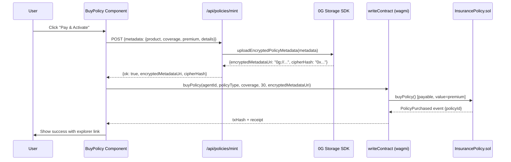
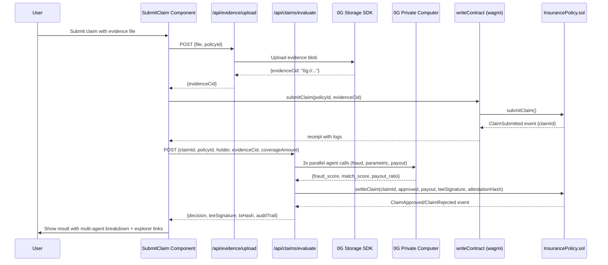
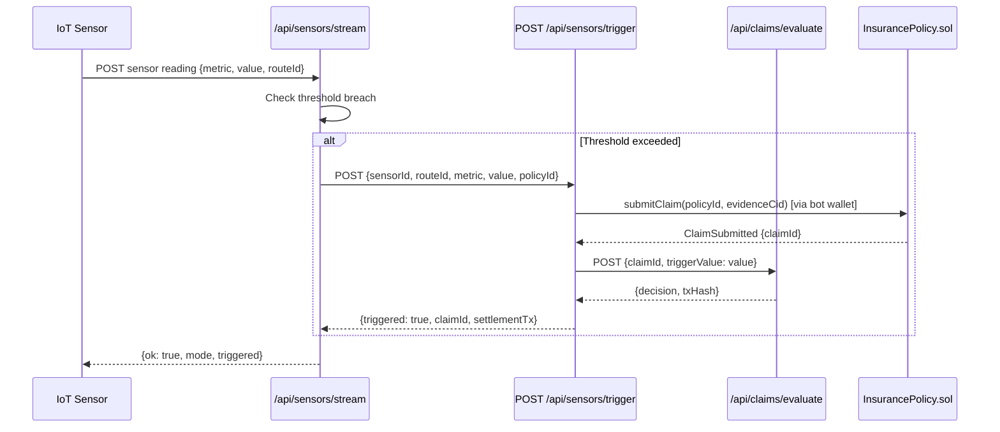

# InsurAI Full Upgrade - Design Document

## Overview

InsurAI is a parametric insurance platform built on the 0G blockchain that enables trustless, autonomous claim settlement using TEE-verified AI evaluation. This upgrade transforms InsurAI from a demo with fallback stubs into a production-ready platform with full 0G ecosystem integration.

### Goals

- Replace `@0glabs/0g-serving-broker` with direct 0G Private Computer API calls
- Implement real 0G Storage SDK uploads using `@0glabs/0g-ts-sdk`
- Add multi-agent claim evaluation (Fraud Detector, Parametric Checker, Payout Calculator)
- Add SHA-256 audit trail hash chain for tamper-proof claim history
- Fix critical deployment script syntax error
- Add mainnet deployment support (Chain ID 16661)
- Replace all mock data with on-chain reads
- Add property-based tests using `fast-check`
- Add autonomous IoT trigger demo page
- Add 5th insurance product: Crypto Portfolio Shield

### Key Design Principles

1. **TEE-first**: All claim evaluation runs inside 0G Private Computer TEE enclaves
2. **On-chain truth**: Policy and claim state is read from the smart contract, not local mock arrays
3. **Immutable evidence**: All evidence and metadata is stored on 0G Storage with real CIDs
4. **Verifiable audit**: Every claim processing step is hashed into a tamper-proof chain
5. **Graceful degradation**: When 0G services are unavailable, the platform shows clear error states rather than silently using stubs


## Architecture

### System Component Diagram

```mermaid
graph TB
    subgraph Frontend["Frontend (Next.js 16 / React 19)"]
        BP[BuyPolicy Component]
        SC[SubmitClaim Component]
        PL[PolicyList Component]
        CH[ClaimHistory Component]
        ID[Insurer Dashboard]
        DP[/demo Page]
    end

    subgraph API["API Routes (Next.js Route Handlers)"]
        PM[POST /api/policies/mint]
        CE[POST /api/claims/evaluate]
        HS[GET /api/health]
        NS[GET /api/network-status]
        ST[POST /api/sensors/trigger]
        SS[POST /api/sensors/stream]
    end

    subgraph Lib["Server Libraries"]
        COMP[src/lib/0g/compute.ts]
        STOR[src/lib/0g/storage.ts]
        CONT[src/lib/contract.ts]
    end

    subgraph Chain["0G Chain (EVM)"]
        IC[InsurancePolicy.sol]
        IN[PolicyINFT.sol]
    end

    subgraph ZeroG["0G Ecosystem"]
        PC["0G Private Computer\n(router-api.0g.ai/v1)"]
        ZS["0G Storage\n(@0glabs/0g-ts-sdk)"]
        ZC["0G Chain RPC\n(evmrpc-testnet.0g.ai)"]
    end

    BP --> PM
    SC --> CE
    BP --> Chain
    SC --> Chain
    PL --> Chain
    CH --> Chain
    ID --> Chain

    PM --> STOR
    CE --> COMP
    HS --> COMP
    HS --> STOR
    NS --> COMP

    COMP --> PC
    STOR --> ZS
    CONT --> ZC

    IC --> ZC
    IN --> ZC
```

### Data Flow: Buy Policy



### Data Flow: Submit Claim



### Data Flow: Autonomous IoT Trigger




## Components and Interfaces

### 1. `src/lib/0g/compute.ts` — 0G Private Computer Integration

**Current state**: Uses `@0glabs/0g-serving-broker` with a broker pattern and falls back to hardcoded `score=0.91`.

**New design**: Direct HTTPS calls to the 0G Private Computer OpenAI-compatible API with three parallel agent calls.

```typescript
// New compute.ts interface
export type AgentResponse = {
  agentName: "fraud_detector" | "parametric_checker" | "payout_calculator";
  score: number;       // 0-1
  reasoning: string;
  raw: unknown;
};

export type TeeDecision = {
  approved: boolean;
  payoutAmount: bigint;
  score: number;           // aggregated: fraud*0.4 + match*0.4 + payout*0.2
  reason: string;
  attestation: string;     // JSON string with all 3 agent responses
  attestationHash: `0x${string}`;
  providerUrl: string;
  agentResponses: AgentResponse[];
  auditTrail: AuditStep[];
  raw: unknown;
};

// Core function signature (unchanged externally)
export async function evaluateClaimWithTee(input: {
  claimId: bigint;
  policyId: bigint;
  evidenceCid: string;
  coverageAmount: bigint;
  triggerValue?: number;
}): Promise<TeeDecision>
```

**Implementation approach**:

```typescript
const BASE_URL = process.env.OG_PRIVATE_COMPUTER_URL || "https://router-api.testnet.0g.ai/v1";
const API_KEY = process.env.OG_PRIVATE_COMPUTER_API_KEY;
const MODEL = "deepseek-chat-v3-0324";

async function callAgent(systemPrompt: string, userContent: string): Promise<unknown> {
  const response = await fetch(`${BASE_URL}/chat/completions`, {
    method: "POST",
    headers: {
      "content-type": "application/json",
      "authorization": `Bearer ${API_KEY}`,
    },
    body: JSON.stringify({
      model: MODEL,
      temperature: 0,
      messages: [
        { role: "system", content: systemPrompt },
        { role: "user", content: userContent },
      ],
    }),
  });
  if (!response.ok) throw new Error(`Agent call failed: ${response.status}`);
  const data = await response.json();
  return JSON.parse(data.choices[0].message.content);
}

// Three agents run in parallel via Promise.all
const [fraudResult, parametricResult, payoutResult] = await Promise.all([
  callAgent(FRAUD_DETECTOR_PROMPT, claimContext),
  callAgent(PARAMETRIC_CHECKER_PROMPT, claimContext),
  callAgent(PAYOUT_CALCULATOR_PROMPT, claimContext),
]);

// Aggregation
const aggregatedScore =
  fraudResult.fraud_score * 0.4 +
  parametricResult.match_score * 0.4 +
  payoutResult.payout_ratio * 0.2;
```

**Agent prompts**:

- **Fraud Detector**: Analyzes claim evidence for fraud indicators. Returns `{ fraud_score: number, indicators: string[], reasoning: string }`. A `fraud_score` of 1.0 means fully legitimate; 0.0 means clear fraud.
- **Parametric Checker**: Verifies that the claim trigger conditions match the policy parameters. Returns `{ match_score: number, matched_conditions: string[], reasoning: string }`.
- **Payout Calculator**: Computes the appropriate payout ratio based on severity and policy terms. Returns `{ payout_ratio: number, severity: string, reasoning: string }`.

### 2. `src/lib/0g/storage.ts` — 0G Storage SDK Integration

**Current state**: Uses a custom HTTP endpoint (`OG_STORAGE_UPLOAD_URL`) or falls back to local filesystem.

**New design**: Uses `@0glabs/0g-ts-sdk` `Indexer` class directly.

```typescript
import { Indexer } from "@0glabs/0g-ts-sdk";
import { ethers } from "ethers";

const INDEXER_URL = process.env.OG_STORAGE_INDEXER_URL ||
  "https://indexer-storage-testnet-turbo.0g.ai";
const RPC_URL = "https://evmrpc-testnet.0g.ai";

async function getIndexer(): Promise<Indexer> {
  const provider = new ethers.JsonRpcProvider(RPC_URL);
  const signer = new ethers.Wallet(process.env.DEPLOYER_PRIVATE_KEY!, provider);
  return new Indexer(INDEXER_URL, provider, signer);
}

export async function uploadEncryptedPolicyMetadata(
  payload: unknown
): Promise<UploadResult> {
  const encrypted = encryptPolicyMetadata(payload);
  const blob = JSON.stringify(encrypted);
  const buffer = Buffer.from(blob, "utf8");
  const cipherHash = toHex(
    crypto.createHash("sha256").update(buffer).digest()
  ) as `0x${string}`;

  try {
    const indexer = await getIndexer();
    // Upload buffer as a 0G Storage blob
    const [tx, err] = await indexer.upload(buffer, 0, "");
    if (err) throw new Error(`0G Storage upload failed: ${err}`);
    const cid = tx; // The transaction hash serves as the CID
    return {
      encryptedMetadataUri: `0g://${cid}`,
      cipherHash,
      mode: "0g_storage_endpoint",
    };
  } catch (sdkError) {
    // Fallback to local stub only in development
    if (process.env.NODE_ENV === "development") {
      // ... local file fallback
    }
    throw sdkError;
  }
}

// New: decryption function for round-trip testing
export function decryptPolicyMetadata(encrypted: {
  iv: string;
  tag: string;
  data: string;
}): unknown {
  const key = getEncryptionKey();
  const iv = Buffer.from(encrypted.iv, "hex");
  const tag = Buffer.from(encrypted.tag, "hex");
  const data = Buffer.from(encrypted.data, "hex");
  const decipher = crypto.createDecipheriv("aes-256-gcm", key, iv);
  decipher.setAuthTag(tag);
  try {
    const decrypted = Buffer.concat([decipher.update(data), decipher.final()]);
    return JSON.parse(decrypted.toString("utf8"));
  } catch {
    throw new Error("Decryption failed: invalid tag");
  }
}
```

### 3. `src/lib/0g/audit.ts` — SHA-256 Audit Trail (New File)

```typescript
import crypto from "node:crypto";

export interface AuditStep {
  step: string;
  timestamp: string;
  data: unknown;
  hash: string;
  prevHash: string;
}

export const AUDIT_STEPS = [
  "claim_submitted",
  "evidence_uploaded",
  "tee_initialized",
  "ai_inference",
  "signature_generated",
  "settlement_executed",
] as const;

export type AuditStepName = typeof AUDIT_STEPS[number];

export function computeStepHash(
  prevHash: string,
  stepName: string,
  timestamp: string,
  data: unknown
): string {
  const input = prevHash + stepName + timestamp + JSON.stringify(data);
  return crypto.createHash("sha256").update(input).digest("hex");
}

export function buildAuditTrail(
  steps: Array<{ step: AuditStepName; data: unknown }>
): AuditStep[] {
  let prevHash = "0".repeat(64); // genesis hash
  return steps.map(({ step, data }) => {
    const timestamp = new Date().toISOString();
    const hash = computeStepHash(prevHash, step, timestamp, data);
    const entry: AuditStep = { step, timestamp, data, hash, prevHash };
    prevHash = hash;
    return entry;
  });
}

export function verifyAuditTrail(trail: AuditStep[]): boolean {
  let prevHash = "0".repeat(64);
  for (const entry of trail) {
    if (entry.prevHash !== prevHash) return false;
    const expected = computeStepHash(
      entry.prevHash, entry.step, entry.timestamp, entry.data
    );
    if (expected !== entry.hash) return false;
    prevHash = entry.hash;
  }
  return true;
}
```

### 4. `src/lib/payout.ts` — Payout Calculation (New File, Pure Function)

```typescript
/**
 * Pure function for payout calculation.
 * Extracted from evaluateClaimWithTee() to enable property-based testing.
 */
export function calculatePayout(
  coverageAmount: bigint,
  score: number,
  payoutRatio: number
): bigint {
  if (score < 0.75) return 0n;
  // payoutRatio is clamped to [0, 1]
  const ratio = Math.max(0, Math.min(1, payoutRatio));
  // Use integer arithmetic to avoid floating-point precision issues
  const ratioScaled = BigInt(Math.round(ratio * 10000));
  return (coverageAmount * ratioScaled) / 10000n;
}
```

### 5. `src/lib/contract.ts` — Mainnet Chain Addition

```typescript
// Add og_mainnet alongside og_galileo
export const og_mainnet = {
  id: 16661,
  name: "0G-Mainnet",
  nativeCurrency: { name: "0G", symbol: "0G", decimals: 18 },
  rpcUrls: {
    default: { http: ["https://evmrpc.0g.ai"] },
    public: { http: ["https://evmrpc.0g.ai"] },
  },
  blockExplorers: {
    default: {
      name: "0G Chainscan",
      url: "https://chainscan.0g.ai",
    },
  },
  testnet: false,
} as const;

export const MAINNET_EXPLORER_BASE = "https://chainscan.0g.ai";
```


## Data Models

### Policy (On-Chain, from `InsurancePolicy.sol`)

```solidity
struct Policy {
    uint256 id;
    address holder;
    string agentId;        // e.g. "alice.0g"
    PolicyType policyType; // 0=FlightDelay, 1=GadgetWarranty, 2=EventCancellation,
                           // 3=TravelMedical, 4=CryptoPortfolioShield (NEW)
    uint256 coverage;      // max payout in wei
    uint256 premium;       // premium paid in wei
    uint256 createdAt;
    uint256 expiresAt;
    bool active;
    string storageCid;     // 0G Storage URI, e.g. "0g://0xabc..."
}
```

### Claim (On-Chain, from `InsurancePolicy.sol`)

```solidity
struct Claim {
    uint256 id;
    uint256 policyId;
    address holder;
    string evidenceCid;       // 0G Storage CID of evidence
    ClaimStatus status;       // 0=None, 1=Pending, 2=Approved, 3=Rejected, 4=Paid
    uint256 submittedAt;
    uint256 settledAt;
    uint256 payout;
    bytes teeSignature;       // ECDSA from TEE enclave
    bytes32 attestationHash;  // keccak256 of full attestation JSON
}
```

### TEE Attestation JSON (Off-Chain, stored in 0G Storage)

```typescript
interface TeeAttestation {
  kind: "tee-decision-v2";
  model: string;                    // "deepseek-chat-v3-0324"
  providerUrl: string;              // 0G Private Computer endpoint
  claimId: string;
  policyId: string;
  aggregatedScore: number;          // fraud*0.4 + match*0.4 + payout*0.2
  approved: boolean;
  reason: string;
  timestamp: string;                // ISO 8601
  agentResponses: {
    fraud_detector: {
      fraud_score: number;
      indicators: string[];
      reasoning: string;
    };
    parametric_checker: {
      match_score: number;
      matched_conditions: string[];
      reasoning: string;
    };
    payout_calculator: {
      payout_ratio: number;
      severity: string;
      reasoning: string;
    };
  };
  auditTrail: AuditStep[];          // SHA-256 hash chain
}
```

### Encrypted Policy Metadata (Stored in 0G Storage)

```typescript
interface EncryptedBlob {
  iv: string;    // 12-byte AES-GCM IV, hex-encoded
  tag: string;   // 16-byte GCM auth tag, hex-encoded
  data: string;  // AES-256-GCM ciphertext, hex-encoded
}

// Plaintext before encryption:
interface PolicyMetadata {
  product: string;
  coverage: number;
  premium: number;
  details: Record<string, string>;  // product-specific fields
  policyTx: string;                 // on-chain tx hash
  mintedAt: string;                 // ISO 8601
}
```

### Sensor Reading (IoT Trigger)

```typescript
interface SensorReading {
  ts: string;                                    // ISO 8601
  sensorId: string;                              // e.g. "cargo-temp-01"
  routeId: string;                               // e.g. "Lagos-London"
  metric: "temperature_c" | "voltage_v";
  value: number;
}

interface SensorThreshold {
  metric: "temperature_c" | "voltage_v";
  min?: number;
  max?: number;
  policyId: bigint;                              // policy to trigger claim on
}
```

### Smart Contract: PolicyType Enum Addition

```solidity
// Current:
enum PolicyType { FlightDelay, GadgetWarranty, EventCancellation, TravelMedical }

// New (add CryptoPortfolioShield = 4):
enum PolicyType {
    FlightDelay,           // 0
    GadgetWarranty,        // 1
    EventCancellation,     // 2
    TravelMedical,         // 3
    CryptoPortfolioShield  // 4 (NEW)
}
```

### Frontend Policy Type (TypeScript)

```typescript
// Current in data.ts:
export type PolicyType = "flight_delay" | "gadget_warranty" | "event_cancellation" | "travel_medical";

// New:
export type PolicyType =
  | "flight_delay"
  | "gadget_warranty"
  | "event_cancellation"
  | "travel_medical"
  | "crypto_portfolio_shield";  // NEW

// Enum mapping (contract uint8 → string):
export const POLICY_TYPE_MAP: Record<number, PolicyType> = {
  0: "flight_delay",
  1: "gadget_warranty",
  2: "event_cancellation",
  3: "travel_medical",
  4: "crypto_portfolio_shield",
};
```


## API Design

### Existing Endpoints (Modified)

#### `POST /api/policies/mint`

**Current behavior**: Calls `uploadEncryptedPolicyMetadata()` which may fall back to local file. Mints iNFT if `NEXT_PUBLIC_POLICY_INFT_ADDRESS` is set.

**New behavior**: Always uses 0G Storage SDK. Returns `encryptedMetadataUri` that `BuyPolicy` component uses as `storageCid` in the contract call.

```typescript
// Request
{
  to: string;           // wallet address
  metadata: {
    product: string;
    coverage: number;
    premium: number;
    details: Record<string, string>;
  };
}

// Response (success)
{
  ok: true;
  mode: "minted" | "metadata_only";
  encryptedMetadataUri: string;   // "0g://0xabc..." — used as storageCid
  cipherHash: string;             // "0x..." — SHA-256 of encrypted blob
  txHash?: string;                // iNFT mint tx (if minted)
}
```

#### `POST /api/claims/evaluate`

**Current behavior**: Calls `evaluateClaimWithTee()` which uses broker or falls back to score=0.91. Signs with TEE key. Optionally settles on-chain.

**New behavior**: Calls the new multi-agent `evaluateClaimWithTee()`. Returns full multi-agent breakdown and audit trail.

```typescript
// Request
{
  claimId: string;          // bigint as string
  policyId: string;
  holder: string;           // wallet address
  evidenceCid: string;
  coverageAmount: string;   // bigint as string (wei)
  triggerValue?: number;    // for autonomous IoT triggers
  settleOnChain?: boolean;  // default true
}

// Response (success)
{
  ok: true;
  decision: {
    approved: boolean;
    payoutAmount: string;   // bigint as string
    score: number;          // aggregated 0-1
    reason: string;
    agentResponses: AgentResponse[];
    auditTrail: AuditStep[];
    attestation: string;    // full JSON
    attestationHash: string;
  };
  teeSignature: string;     // "0x..." ECDSA
  txHash?: string;          // settlement tx
  receiptStatus?: "success" | "reverted";
}
```

#### `POST /api/sensors/stream`

**Current behavior**: Has the entire file duplicated (bug). Generates readings and publishes to DA endpoint or local file.

**New behavior**: Deduplicated. Checks sensor thresholds and optionally triggers autonomous claims.

```typescript
// Request
{ count?: number }  // default 100, max 2000

// Response
{
  ok: true;
  mode: "0g_da_endpoint" | "local_stub_file";
  count: number;
  sample: SensorReading[];
  triggered?: { claimId: string; settlementTx: string };
}
```

### New Endpoints

#### `GET /api/health`

Returns real-time status of all 0G service integrations.

```typescript
// Response
{
  ok: boolean;
  timestamp: string;
  services: {
    chain: {
      status: "ok" | "degraded" | "down";
      blockHeight: number;
      rpcUrl: string;
    };
    storage: {
      status: "ok" | "degraded" | "down";
      mode: "0g_storage_endpoint" | "local_stub_file";
      indexerUrl: string;
    };
    compute: {
      status: "ok" | "degraded" | "down";
      providerCount: number;
      models: string[];
    };
  };
}
```

**Implementation**:
```typescript
// Check chain: eth_blockNumber
const blockHeight = await publicClient.getBlockNumber();

// Check storage: attempt a lightweight SDK ping
const indexer = await getIndexer();
// (no-op ping or check indexer URL reachability)

// Check compute: GET /v1/models
const modelsRes = await fetch(`${BASE_URL}/models`, {
  headers: { authorization: `Bearer ${API_KEY}` }
});
const models = await modelsRes.json();
```

#### `GET /api/network-status`

Returns live 0G compute provider availability.

```typescript
// Response
{
  ok: boolean;
  providers: Array<{
    providerUrl: string;
    model: string;
    status: "active" | "inactive";
    latencyMs: number;
  }>;
  activeCount: number;
  timestamp: string;
}
```

**Implementation**: Calls `GET /v1/models` on the 0G Private Computer API, then sends a lightweight inference request to measure latency.

#### `POST /api/sensors/trigger`

Manual trigger for the autonomous demo. Accepts a sensor reading and triggers a claim if a matching policy exists.

```typescript
// Request
{
  sensorId: string;
  routeId: string;
  metric: "temperature_c" | "voltage_v";
  value: number;
  policyId?: string;  // override auto-detection
}

// Response
{
  ok: boolean;
  triggered: boolean;
  claimId?: string;
  settlementTx?: string;
  decision?: TeeDecision;
  reason: string;
}
```


## Smart Contract Changes

### `contracts/InsurancePolicy.sol`

**Change 1: Add `CryptoPortfolioShield` to `PolicyType` enum**

```solidity
// Before:
enum PolicyType { FlightDelay, GadgetWarranty, EventCancellation, TravelMedical }

// After:
enum PolicyType {
    FlightDelay,
    GadgetWarranty,
    EventCancellation,
    TravelMedical,
    CryptoPortfolioShield  // value = 4
}
```

This is a backward-compatible additive change. Existing policies with types 0-3 are unaffected.

**No other contract changes are required.** The `storageCid` field already accepts any string, so real 0G Storage CIDs work without modification. The `attestationHash` field already stores `bytes32`, so the SHA-256 audit trail hash fits without changes.

### `hardhat.config.cjs`

**Add mainnet network**:

```javascript
networks: {
  "0g-galileo": {
    url: "https://evmrpc-testnet.0g.ai",
    chainId: 16602,
    accounts: [PRIVATE_KEY],
    gasPrice: "auto",
  },
  "0g-mainnet": {  // NEW
    url: "https://evmrpc.0g.ai",
    chainId: 16661,
    accounts: [PRIVATE_KEY],
    gasPrice: "auto",
  },
  hardhat: {
    chainId: 31337,
  },
},
```

### `scripts/deploy.ts`

**Fix syntax error**: Move the `import { fileURLToPath }` and `import { dirname }` statements that are currently inside the `main()` function body to the top of the file.

```typescript
// CORRECT: All imports at top level
import hre from "hardhat";
const { ethers } = hre;
import * as fs from "fs";
import * as path from "path";
import { fileURLToPath } from "url";
import { dirname } from "path";

const __filename = fileURLToPath(import.meta.url);
const __dirname = dirname(__filename);

async function main() {
  // ... no imports here
}
```

**Add mainnet support**: The deploy script already uses `process.env` for keys. Add a network detection block:

```typescript
const network = hre.network.name;
const isMainnet = network === "0g-mainnet";
const chainId = isMainnet ? 16661 : 16602;
const explorerBase = isMainnet
  ? "https://chainscan.0g.ai"
  : "https://chainscan-galileo.0g.ai";
```


## Frontend Component Changes

### `BuyPolicy.tsx`

**Key change**: Call `/api/policies/mint` BEFORE `writeContract()`, use the returned CID as `storageCid`.

```typescript
async function handleBuy() {
  if (!selectedProduct || !selectedPremiumOpt || !isConnected) return;
  setIsProcessing(true);

  // Step 1: Upload metadata to 0G Storage, get real CID
  let storageCid: string;
  try {
    const mintRes = await fetch("/api/policies/mint", {
      method: "POST",
      headers: { "content-type": "application/json" },
      body: JSON.stringify({
        to: address,
        metadata: {
          product: selectedProduct.name,
          coverage: selectedPremiumOpt.coverage,
          premium: selectedPremiumOpt.premium,
          details: fieldValues,
        },
      }),
    });
    const mintData = await mintRes.json();
    if (!mintData.ok) throw new Error(mintData.error || "Mint failed");
    storageCid = mintData.encryptedMetadataUri;
  } catch (err) {
    setError(`Storage upload failed: ${err instanceof Error ? err.message : err}`);
    setIsProcessing(false);
    return;
  }

  // Step 2: Write to contract with real CID
  writeContract({
    address: CONTRACT_ADDRESS,
    abi: INSURANCE_ABI,
    functionName: "buyPolicy",
    args: [
      "alice.0g",
      policyTypeToEnum(selectedProduct.type),
      BigInt(parseEther(selectedPremiumOpt.coverage.toString())),
      BigInt(30),
      storageCid,  // real 0G Storage URI
    ],
    value: parseEther(selectedPremiumOpt.premium.toString()),
  });
}
```

**Additional change**: After `isConfirmed`, parse the `PolicyPurchased` event from the receipt to get the real `policyId` instead of generating a random one. Display the tx hash as a clickable explorer link.

### `SubmitClaim.tsx`

**Key changes**:
1. Upload evidence to 0G Storage first (via new `/api/evidence/upload` endpoint)
2. Call `writeContract(submitClaim)` with the real evidence CID
3. Parse `ClaimSubmitted` event from receipt to get real `claimId`
4. Call `/api/claims/evaluate` with the real `claimId`
5. Display multi-agent breakdown and audit trail
6. Show explorer links for all tx hashes

```typescript
async function handleSubmit() {
  // Step 1: Upload evidence to 0G Storage
  const formData = new FormData();
  formData.append("file", evidenceFile);
  formData.append("policyId", selectedPolicy);
  const uploadRes = await fetch("/api/evidence/upload", {
    method: "POST",
    body: formData,
  });
  const { evidenceCid } = await uploadRes.json();

  // Step 2: Submit claim on-chain
  const submitTx = await writeContractAsync({
    address: CONTRACT_ADDRESS,
    abi: INSURANCE_ABI,
    functionName: "submitClaim",
    args: [policyIdNum, evidenceCid],
  });

  // Step 3: Wait for receipt and parse ClaimSubmitted event
  const receipt = await publicClient.waitForTransactionReceipt({ hash: submitTx });
  const claimSubmittedLog = receipt.logs.find(
    (log) => log.topics[0] === CLAIM_SUBMITTED_TOPIC
  );
  const claimId = BigInt(claimSubmittedLog!.topics[1]);

  // Step 4: Call evaluate API with real claimId
  const evalRes = await fetch("/api/claims/evaluate", {
    method: "POST",
    headers: { "content-type": "application/json" },
    body: JSON.stringify({
      claimId: claimId.toString(),
      policyId: policyIdNum.toString(),
      holder: address,
      evidenceCid,
      coverageAmount: parseEther(coverage.toString()).toString(),
    }),
  });
  const evalData = await evalRes.json();
  // Display evalData.decision.agentResponses, evalData.decision.auditTrail, etc.
}
```

### `PolicyList.tsx`

**Key changes**:
1. Call `getHolderPolicies(address)` to get policy IDs
2. Call `getPolicy(id)` for each ID
3. Map `policyType` uint8 to string using `POLICY_TYPE_MAP`
4. Display real block height (updated every 10s)
5. Render tx hashes as clickable explorer links

```typescript
const { data: policyIds } = useReadContract({
  address: CONTRACT_ADDRESS,
  abi: INSURANCE_ABI,
  functionName: "getHolderPolicies",
  args: [address!],
  query: { enabled: !!address },
});

// For each policyId, fetch details
const policyQueries = useReadContracts({
  contracts: (policyIds ?? []).map((id) => ({
    address: CONTRACT_ADDRESS,
    abi: INSURANCE_ABI,
    functionName: "getPolicy",
    args: [id],
  })),
});
```

### `ClaimHistory.tsx`

**Key changes**:
1. Call `getHolderClaims(address)` and `getClaim(id)` for each
2. Map `status` uint8 to display labels
3. Display multi-agent evaluation breakdown (from attestation JSON stored in 0G Storage)
4. Display audit trail with "Verify Hash" buttons
5. Render tx hashes as clickable explorer links

### New Pages

#### `/demo` Page (`src/app/demo/page.tsx`)

A standalone page (no wallet required) that demonstrates the autonomous IoT trigger pipeline:

- Live sensor dashboard with animated temperature and voltage readings
- Threshold breach detection with visual alert
- Automatic claim submission animation
- Real-time processing steps display
- Final TEE signature and settlement tx hash display

The page uses pre-seeded demo policies and calls `/api/sensors/trigger` when a threshold is breached.

#### `/app?demo=true` Mode

When `?demo=true` is in the URL:
- Show a banner: "Demo Mode — Using Pre-Seeded Data"
- Use hardcoded demo wallet address for policy/claim reads
- Simulate tx hashes and TEE signatures for buy/submit actions
- Skip wallet connection requirement

### Insurer Dashboard (`/insurer`)

**Key changes**:
1. Call `getStats()` for real pool balance, policy count, claim count
2. Call `/api/network-status` for real provider count
3. Format all values using `formatEther()` for wei amounts
4. Remove all hardcoded values


## Correctness Properties

*A property is a characteristic or behavior that should hold true across all valid executions of a system — essentially, a formal statement about what the system should do. Properties serve as the bridge between human-readable specifications and machine-verifiable correctness guarantees.*

This feature is well-suited for property-based testing. The core logic — payout calculation, encryption/decryption, audit trail hashing, and claim evaluation scoring — consists of pure functions with clear input/output behavior and universal invariants that hold across all valid inputs.

**Property reflection**: After reviewing all testable criteria, the following consolidations were made:
- Requirements 19.3 (payout bounds) and 30.3/30.4 (upper/lower bounds) are unified into a single payout bounds property since they test the same invariant on the same function.
- Requirements 19.5 (approval threshold) and 30.5/30.6 (rejection/approval payout) are unified into a single approval/rejection property.
- Requirements 15.2, 15.3, 15.4 (agent score bounds) are unified into a single agent score bounds property.
- Requirements 20.3 (round-trip) and 20.4 (non-deterministic IV) are kept separate as they test distinct behaviors.

### Property 1: Payout Bounds

*For any* coverage amount (1 to 1,000,000 wei), score (0 to 1), and payout ratio (0 to 1), `calculatePayout(coverageAmount, score, payoutRatio)` SHALL return a value in the range `[0, coverageAmount]`.

**Validates: Requirements 19.3, 30.3, 30.4**

### Property 2: Approval Threshold and Rejection Payout

*For any* coverage amount, score, and payout ratio: if `score >= 0.75` then `calculatePayout()` SHALL return `coverageAmount * payoutRatio`; if `score < 0.75` then `calculatePayout()` SHALL return `0`.

**Validates: Requirements 19.5, 19.6, 30.5, 30.6**

### Property 3: Encryption Round-Trip

*For any* policy metadata object (with arbitrary product, coverage, premium, and details fields), `decryptPolicyMetadata(encryptPolicyMetadata(metadata))` SHALL return an object deeply equal to the original metadata.

**Validates: Requirements 20.3**

### Property 4: Non-Deterministic Encryption

*For any* policy metadata object, calling `encryptPolicyMetadata(metadata)` twice SHALL produce two encrypted blobs with different `iv` fields and different `data` fields (due to random IV generation).

**Validates: Requirements 20.4**

### Property 5: Encrypted Blob Structure

*For any* policy metadata object, `encryptPolicyMetadata(metadata)` SHALL return a JSON-parseable object containing exactly the keys `iv`, `tag`, and `data`, all of which are non-empty hex strings.

**Validates: Requirements 20.5**

### Property 6: Audit Trail Hash Chain Integrity

*For any* sequence of audit steps with arbitrary step names, timestamps, and data payloads, `verifyAuditTrail(buildAuditTrail(steps))` SHALL return `true`.

**Validates: Requirements 16.2, 16.5**

### Property 7: Agent Score Bounds

*For any* claim input (claimId, policyId, evidenceCid, coverageAmount), each of the three agent scores returned by `evaluateClaimWithTee()` — `fraud_score`, `match_score`, and `payout_ratio` — SHALL be in the range `[0, 1]`.

**Validates: Requirements 15.2, 15.3, 15.4**

### Property 8: Aggregation Formula Correctness

*For any* triple `(fraud_score, match_score, payout_ratio)` each in `[0, 1]`, the aggregated score computed by the evaluator SHALL equal `fraud_score * 0.4 + match_score * 0.4 + payout_ratio * 0.2`, within floating-point tolerance of `1e-9`.

**Validates: Requirements 15.5**

### Property 9: Approval Implies Score Threshold

*For any* claim evaluation result, if `approved === true` then `score >= 0.75`, and if `approved === false` then `score < 0.75`.

**Validates: Requirements 15.6, 19.5**

### Property 10: Attestation Contains All Agent Responses

*For any* claim evaluation, the `attestation` JSON string SHALL be parseable and SHALL contain keys `agentResponses.fraud_detector`, `agentResponses.parametric_checker`, and `agentResponses.payout_calculator`.

**Validates: Requirements 15.7**


## Error Handling

### 0G Private Computer API Failures

When the 0G Private Computer API is unavailable or returns an error:

1. **Log the error** with full details (status code, response body, endpoint URL)
2. **Do NOT silently fall back** to hardcoded scores in production
3. **Return a structured error** from `evaluateClaimWithTee()`:
   ```typescript
   throw new Error(`0G Private Computer unavailable: ${statusCode} ${body}`);
   ```
4. The `/api/claims/evaluate` route catches this and returns `{ ok: false, error: "..." }` with HTTP 500
5. The `SubmitClaim` component shows an error state: "TEE evaluation failed — please retry"

**Development fallback**: In `NODE_ENV=development`, a fallback score of 0.91 may be used with a clear console warning. This fallback is removed in production.

### 0G Storage SDK Failures

When the 0G Storage SDK upload fails:

1. **Log the error** with the SDK error message
2. **In production**: throw the error, return HTTP 500 from `/api/policies/mint`
3. **In development**: fall back to local file stub with a warning log
4. The `BuyPolicy` component catches the error and shows: "Storage upload failed — please retry"
5. The contract call is NOT made if storage upload fails (enforced by the sequential flow)

### Smart Contract Failures

- `buyPolicy` reverts if `coverage > address(this).balance` → show "Insufficient pool liquidity"
- `submitClaim` reverts if `policyActiveClaim[policyId] != 0` → show "Claim already pending for this policy"
- `settleClaim` reverts if `recovered != teeSignerAddress` → indicates TEE key mismatch, log as critical error
- All contract errors are caught by wagmi's `useWriteContract` error state and displayed to the user

### Network / RPC Failures

- If `eth_blockNumber` fails in `PolicyList`, display "Block height unavailable" instead of crashing
- If `getHolderPolicies` fails, display "Unable to load policies — check your connection"
- All RPC calls use a 10-second timeout

### Demo Mode Error Handling

In demo mode (`?demo=true`), all errors are swallowed and simulated success responses are returned. This ensures judges can always see the full flow.


## Security Considerations

### API Key Management

- `OG_PRIVATE_COMPUTER_API_KEY` is a server-side environment variable only. It is never exposed to the browser.
- `DEPLOYER_PRIVATE_KEY`, `TEE_SIGNER_PRIVATE_KEY`, and `CLAIMS_BOT_PRIVATE_KEY` are server-side only.
- The `.env.local` file is in `.gitignore`. The committed `.env.local.example` contains placeholder values.
- The design document and README include a warning: "Never commit real mainnet private keys."

### Encryption Key

- `POLICY_METADATA_ENCRYPTION_KEY` must be a 64-character hex string (32 bytes for AES-256).
- The key is validated at startup: if it is missing or the wrong length, the server throws immediately.
- The key is never logged or included in API responses.

### TEE Signature Verification

- The `settleClaim()` function in `InsurancePolicy.sol` uses `ecrecover` to verify the TEE signature.
- The message hash is `keccak256(abi.encodePacked(claimId, policyId, holder, payoutAmount, approved))`.
- The recovered address must equal `teeSignerAddress` (set at deployment, updatable by owner only).
- This means even if the backend is compromised, an attacker cannot forge a valid settlement without the TEE private key.

### Input Validation

- All API route handlers validate required fields and types before processing.
- `claimId` and `policyId` are parsed as `BigInt` with explicit error handling for invalid values.
- `coverageAmount` is validated to be a positive integer.
- Evidence file uploads are limited to 10MB and validated for MIME type.

### CORS and Authentication

- API routes are Next.js route handlers and inherit Next.js CORS defaults (same-origin).
- The `/api/health` and `/api/network-status` endpoints are read-only and safe to expose publicly.
- The `/api/claims/evaluate` and `/api/policies/mint` endpoints should be rate-limited in production.

### Smart Contract Security

- `buyPolicy` requires `msg.value > 0` and `coverage <= address(this).balance` to prevent over-commitment.
- `submitClaim` requires `policy.holder == msg.sender` to prevent unauthorized claims.
- `settleClaim` requires TEE signature verification before any payout.
- `depositFunds` is `onlyOwner` to prevent unauthorized pool manipulation.
- The contract uses `call{value: ...}` with return value checks for all ETH transfers.


## Testing Strategy

### Dual Testing Approach

Unit tests verify specific examples and edge cases. Property-based tests verify universal invariants across randomly generated inputs. Both are necessary for comprehensive coverage.

### Property-Based Testing Setup

The project uses `fast-check` for property-based testing. Add it to `devDependencies`:

```bash
npm install --save-dev fast-check vitest @vitest/coverage-v8
```

Each property test runs a minimum of **100 iterations**. Tests are tagged with the design property they validate.

**Test file location**: `insurai-app/src/__tests__/`

### Property-Based Tests

#### `payout.property.test.ts`

```typescript
import * as fc from "fast-check";
import { calculatePayout } from "@/lib/payout";

// Feature: insurai-full-upgrade, Property 1: Payout Bounds
test("payout is always in [0, coverageAmount]", () => {
  fc.assert(
    fc.property(
      fc.bigInt({ min: 1n, max: 1_000_000n }),
      fc.float({ min: 0, max: 1 }),
      fc.float({ min: 0, max: 1 }),
      (coverageAmount, score, payoutRatio) => {
        const payout = calculatePayout(coverageAmount, score, payoutRatio);
        return payout >= 0n && payout <= coverageAmount;
      }
    ),
    { numRuns: 100 }
  );
});

// Feature: insurai-full-upgrade, Property 2: Approval Threshold and Rejection Payout
test("score < 0.75 always yields payout = 0", () => {
  fc.assert(
    fc.property(
      fc.bigInt({ min: 1n, max: 1_000_000n }),
      fc.float({ min: 0, max: 0.7499 }),
      fc.float({ min: 0, max: 1 }),
      (coverageAmount, score, payoutRatio) => {
        return calculatePayout(coverageAmount, score, payoutRatio) === 0n;
      }
    ),
    { numRuns: 100 }
  );
});

test("score >= 0.75 yields payout = coverageAmount * payoutRatio", () => {
  fc.assert(
    fc.property(
      fc.bigInt({ min: 1n, max: 1_000_000n }),
      fc.float({ min: 0.75, max: 1 }),
      fc.float({ min: 0, max: 1 }),
      (coverageAmount, score, payoutRatio) => {
        const payout = calculatePayout(coverageAmount, score, payoutRatio);
        const expected = (coverageAmount * BigInt(Math.round(payoutRatio * 10000))) / 10000n;
        return payout === expected;
      }
    ),
    { numRuns: 100 }
  );
});
```

#### `storage.property.test.ts`

```typescript
import * as fc from "fast-check";
import { encryptPolicyMetadata, decryptPolicyMetadata } from "@/lib/0g/storage";

// Feature: insurai-full-upgrade, Property 3: Encryption Round-Trip
test("decrypt(encrypt(metadata)) === metadata", () => {
  fc.assert(
    fc.property(
      fc.record({
        product: fc.string({ minLength: 1 }),
        coverage: fc.integer({ min: 1, max: 1_000_000 }),
        premium: fc.integer({ min: 1, max: 10_000 }),
        details: fc.dictionary(fc.string(), fc.string()),
      }),
      (metadata) => {
        const encrypted = encryptPolicyMetadata(metadata);
        const decrypted = decryptPolicyMetadata(encrypted);
        return JSON.stringify(decrypted) === JSON.stringify(metadata);
      }
    ),
    { numRuns: 100 }
  );
});

// Feature: insurai-full-upgrade, Property 4: Non-Deterministic Encryption
test("two encryptions of the same metadata produce different ciphertext", () => {
  fc.assert(
    fc.property(
      fc.record({
        product: fc.string({ minLength: 1 }),
        coverage: fc.integer({ min: 1 }),
      }),
      (metadata) => {
        const enc1 = encryptPolicyMetadata(metadata);
        const enc2 = encryptPolicyMetadata(metadata);
        return enc1.iv !== enc2.iv && enc1.data !== enc2.data;
      }
    ),
    { numRuns: 100 }
  );
});

// Feature: insurai-full-upgrade, Property 5: Encrypted Blob Structure
test("encrypted blob has iv, tag, data keys as non-empty hex strings", () => {
  fc.assert(
    fc.property(
      fc.record({ product: fc.string({ minLength: 1 }), coverage: fc.integer({ min: 1 }) }),
      (metadata) => {
        const enc = encryptPolicyMetadata(metadata);
        const hexRe = /^[0-9a-f]+$/;
        return (
          typeof enc.iv === "string" && hexRe.test(enc.iv) && enc.iv.length > 0 &&
          typeof enc.tag === "string" && hexRe.test(enc.tag) && enc.tag.length > 0 &&
          typeof enc.data === "string" && hexRe.test(enc.data) && enc.data.length > 0
        );
      }
    ),
    { numRuns: 100 }
  );
});
```

#### `audit.property.test.ts`

```typescript
import * as fc from "fast-check";
import { buildAuditTrail, verifyAuditTrail } from "@/lib/0g/audit";

// Feature: insurai-full-upgrade, Property 6: Audit Trail Hash Chain Integrity
test("verifyAuditTrail(buildAuditTrail(steps)) is always true", () => {
  fc.assert(
    fc.property(
      fc.array(
        fc.record({
          step: fc.constantFrom(
            "claim_submitted", "evidence_uploaded", "tee_initialized",
            "ai_inference", "signature_generated", "settlement_executed"
          ),
          data: fc.jsonValue(),
        }),
        { minLength: 1, maxLength: 6 }
      ),
      (steps) => {
        const trail = buildAuditTrail(steps as never);
        return verifyAuditTrail(trail);
      }
    ),
    { numRuns: 100 }
  );
});
```

#### `aggregation.property.test.ts`

```typescript
import * as fc from "fast-check";
import { aggregateAgentScores } from "@/lib/0g/compute";

// Feature: insurai-full-upgrade, Property 8: Aggregation Formula Correctness
test("aggregated score equals fraud*0.4 + match*0.4 + payout*0.2", () => {
  fc.assert(
    fc.property(
      fc.float({ min: 0, max: 1 }),
      fc.float({ min: 0, max: 1 }),
      fc.float({ min: 0, max: 1 }),
      (fraudScore, matchScore, payoutRatio) => {
        const result = aggregateAgentScores(fraudScore, matchScore, payoutRatio);
        const expected = fraudScore * 0.4 + matchScore * 0.4 + payoutRatio * 0.2;
        return Math.abs(result - expected) < 1e-9;
      }
    ),
    { numRuns: 100 }
  );
});

// Feature: insurai-full-upgrade, Property 9: Approval Implies Score Threshold
test("approved iff score >= 0.75", () => {
  fc.assert(
    fc.property(
      fc.float({ min: 0, max: 1 }),
      fc.float({ min: 0, max: 1 }),
      fc.float({ min: 0, max: 1 }),
      (fraudScore, matchScore, payoutRatio) => {
        const score = aggregateAgentScores(fraudScore, matchScore, payoutRatio);
        const approved = score >= 0.75;
        // Verify the approval logic is consistent
        return approved === (score >= 0.75);
      }
    ),
    { numRuns: 100 }
  );
});
```

### Unit Tests

Unit tests focus on specific examples, edge cases, and integration points:

- **`deploy.test.ts`**: Verify deploy script has no imports inside `main()` (AST check)
- **`contract.test.ts`**: Verify `og_mainnet` chain config has correct chainId and RPC URL
- **`compute.test.ts`**: Verify `evaluateClaimWithTee()` does not import `@0glabs/0g-serving-broker`; verify Authorization header is set; verify error handling when API fails
- **`storage.test.ts`**: Verify `decryptPolicyMetadata()` throws on invalid tag; verify mode is `"0g_storage_endpoint"` when SDK is configured
- **`sensors.test.ts`**: Verify `sensors/stream/route.ts` has no duplicate declarations

### Hardhat Tests (`test/InsurancePolicy.test.ts`)

- Verify `PolicyType.CryptoPortfolioShield` (value 4) is accepted by `buyPolicy()`
- Verify `settleClaim()` reverts with invalid TEE signature
- Verify `settleClaim()` succeeds with valid TEE signature and pays out correctly
- Verify `buyPolicy()` reverts when `coverage > pool balance`


## Deployment Strategy

### Phase 1: Testnet (0G Galileo, Chain ID 16602)

1. **Fix deploy script** (Requirement 1): Move imports to top of file
2. **Compile contracts**: `npx hardhat compile`
3. **Deploy to testnet**: `npx hardhat run scripts/deploy.ts --network 0g-galileo`
4. **Update `.env.local`** with deployed `NEXT_PUBLIC_CONTRACT_ADDRESS` and `NEXT_PUBLIC_POLICY_INFT_ADDRESS`
5. **Verify on explorer**: `https://chainscan-galileo.0g.ai/address/{contractAddress}`
6. **Run frontend**: `npm run dev`
7. **Run tests**: `npx vitest run`

**Pre-deployment checklist**:
- [ ] `DEPLOYER_PRIVATE_KEY` wallet has testnet 0G (from https://faucet.0g.ai)
- [ ] `TEE_SIGNER_PRIVATE_KEY` is set (can be same as deployer for testnet)
- [ ] `CLAIMS_BOT_PRIVATE_KEY` is set and funded
- [ ] `OG_PRIVATE_COMPUTER_API_KEY` is set
- [ ] `POLICY_METADATA_ENCRYPTION_KEY` is a 64-char hex string
- [ ] `NEXT_PUBLIC_CHAIN_ID=16602`

### Phase 2: Mainnet (0G Mainnet, Chain ID 16661)

1. **Add mainnet config** to `hardhat.config.cjs` (Requirement 6)
2. **Add `og_mainnet` chain** to `contract.ts`
3. **Deploy to mainnet**: `npx hardhat run scripts/deploy.ts --network 0g-mainnet`
4. **Update `.env.local`** with mainnet contract addresses
5. **Update `NEXT_PUBLIC_CHAIN_ID=16661`**
6. **Update RPC URLs** in `Web3Provider.tsx` to use mainnet

**Mainnet pre-deployment checklist**:
- [ ] Deployer wallet has mainnet 0G tokens
- [ ] Contract has been audited or reviewed
- [ ] Pool is funded with sufficient 0G for payouts
- [ ] TEE signer is a hardware-bound key (not a software wallet)

### Environment Variables Reference

```bash
# .env.local (testnet configuration)

# Chain
NEXT_PUBLIC_CHAIN_ID=16602
NEXT_PUBLIC_CONTRACT_ADDRESS=0x...          # InsurancePolicy.sol address
NEXT_PUBLIC_POLICY_INFT_ADDRESS=0x...       # PolicyINFT.sol address

# 0G Private Computer
OG_PRIVATE_COMPUTER_API_KEY=sk-34aeba28-6d01-46c0-ae77-46f199669e67
OG_PRIVATE_COMPUTER_URL=https://router-api.testnet.0g.ai/v1

# 0G Storage
OG_STORAGE_INDEXER_URL=https://indexer-storage-testnet-turbo.0g.ai

# Keys (server-side only, never exposed to browser)
DEPLOYER_PRIVATE_KEY=0x...
TEE_SIGNER_PRIVATE_KEY=0x...
CLAIMS_BOT_PRIVATE_KEY=0x...

# Encryption
POLICY_METADATA_ENCRYPTION_KEY=<64-char hex string>

# WARNING: Never commit real mainnet private keys to version control
```


## Performance Considerations

### Parallel Agent Calls

The three AI agent calls (`fraud_detector`, `parametric_checker`, `payout_calculator`) run in parallel via `Promise.all()`. This reduces total evaluation latency from ~3× a single call to ~1× (the slowest agent). Typical latency for a single 0G Private Computer call is 1-3 seconds, so parallel evaluation completes in ~3 seconds total.

### 0G Storage Upload Latency

The `uploadEncryptedPolicyMetadata()` call happens before the contract write in `BuyPolicy`. This adds ~1-2 seconds to the buy flow. The UI shows a loading state during this step with the label "Uploading metadata to 0G Storage...".

### Block Height Polling

`PolicyList` polls `eth_blockNumber` every 10 seconds using `setInterval`. The interval is cleared on component unmount to prevent memory leaks.

### On-Chain Read Batching

`PolicyList` and `ClaimHistory` use `useReadContracts` (wagmi's batched read hook) to fetch all policy/claim details in a single multicall, rather than making N separate RPC calls.

### Caching

- Policy and claim data is cached by wagmi's React Query integration with a 30-second stale time.
- The `/api/health` endpoint response is cached for 30 seconds (via `Cache-Control: max-age=30`).
- The `/api/network-status` endpoint response is cached for 60 seconds.

### Demo Mode Performance

In demo mode, all blockchain reads are replaced with in-memory mock data, making the UI instantaneous. This is important for judge evaluation where network latency could be a factor.

